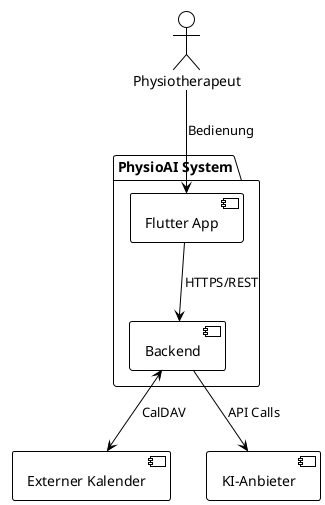
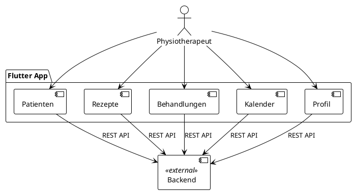
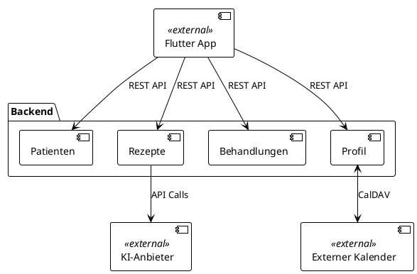

# 5. Bausteinsicht

Die Bausteinsicht zeigt die statische Zerlegung des PhysioAI-Systems in Bausteine (Module, Komponenten, Subsysteme)
sowie deren Beziehungen. Diese Sicht entspricht dem "Grundriss" der Systemarchitektur.

## 5.1 Whitebox Gesamtsystem

Das PhysioAI-System besteht aus zwei Hauptbausteinen: einer Flutter App als Benutzeroberfläche und einem Backend für die Geschäftslogik. Das System integriert sich über standardisierte Schnittstellen mit externen Kalendern und KI-Anbietern.

### 5.1.1 Übersicht

### 5.1.2 Enthaltene Bausteine

| Name | Verantwortlichkeit |
|------|-------------------|
| **Flutter App** | Benutzeroberfläche für Physiotherapeuten |
| **Backend** | Geschäftslogik, Datenhaltung und externe Integrationen |

## 5.2 Ebene 2

### 5.2.1 Whitebox Flutter App

Die Flutter App ist in fachliche Module strukturiert, die jeweils die Benutzeroberfläche für spezifische Bereiche der Physiotherapiepraxis bereitstellen.

#### Übersicht

#### Enthaltene Bausteine

| Name | Verantwortlichkeit |
|------|-------------------|
| **Patienten** | Patientenverwaltung und -anzeige |
| **Rezepte** | Rezepterfassung und -verarbeitung |
| **Behandlungen** | Behandlungsplanung und -dokumentation |
| **Kalender** | Terminverwaltung und Kalenderansicht |
| **Profil** | Benutzerprofileinstellungen |

**Begründung der Struktur:**

Die fachlichen UI-Module entsprechen den Domain-Modulen des Backends und ermöglichen eine klare Trennung der Benutzeroberflächen-Verantwortlichkeiten. Jedes Modul kommuniziert direkt mit dem Backend über REST APIs.

### 5.2.2 Whitebox Backend

Das Backend ist in fachliche Module strukturiert, die jeweils spezifische Geschäftsbereiche der Physiotherapiepraxis abbilden.

#### Übersicht

#### Enthaltene Bausteine

| Name | Verantwortlichkeit |
|------|-------------------|
| **Patienten** | Patientenstammdaten und Patientenverwaltung |
| **Rezepte** | KI-gestützte Rezeptverarbeitung und -verwaltung |
| **Behandlungen** | Behandlungsplanung und -dokumentation |
| **Profil** | Benutzerprofile und Kalenderintegration |

**Begründung der Struktur:**

Die fachlichen Module entsprechen den natürlichen Bounded Contexts der Physiotherapie-Domäne und folgen dem Domain-Driven Design. Jedes Modul ist für seinen spezifischen Geschäftsbereich verantwortlich und kommuniziert über die REST API mit der Flutter App.
