# 3. Kontextabgrenzung

Die Kontextabgrenzung zeigt das PhysioAI-System als zentrales System (Black Box) und grenzt es von seinen externen
Kommunikationspartnern ab. Sie definiert die externen Schnittstellen und zeigt, welche Verantwortlichkeiten zum System
gehören und welche zu benachbarten Systemen.

## 3.1 Fachlicher Kontext

Der fachliche Kontext zeigt die domänenspezifischen Ein- und Ausgaben des PhysioAI-Systems sowie die fachlichen Akteure
und externen Systeme.

```mermaid
flowchart TD
%% Akteure
    Physio[👤 Physiotherapeut]

%% Zentrales System
PhysioAI[PhysioAI System]

%% Externe Systeme
Kalender[📅 Privater Kalender]
KI[🤖 KI-Anbieter API]

%% Datenflüsse - Physiotherapeut
Physio -->|Praxis Verwaltung|PhysioAI

%% Datenflüsse - Kalender
Kalender -->|Private Termine abrufen|PhysioAI
PhysioAI -->|iCal Behandlungstermine|Kalender

%% Datenflüsse - KI (nur Ausgabe aus dem System)
PhysioAI -->|Patientendaten zur Analyse|KI

%% Styling
classDef actor fill: #e1f5fe, stroke: #01579b, stroke-width: 2px
classDef system fill: #f3e5f5, stroke: #4a148c, stroke-width: 3px
classDef external fill: #e8f5e8, stroke: #1b5e20, stroke-width: 2px

class Physio actor
class PhysioAI system
class Kalender,KI external
```

### Fachliche Schnittstellen

| Partner               | Eingabe                                                       | Ausgabe                                                             |
|-----------------------|---------------------------------------------------------------|---------------------------------------------------------------------|
| **Physiotherapeut**   | Praxis Verwaltung (Patienten, Behandlungen, Rezepte, Termine) | *(keine direkte Ausgabe)*                                           |
| **Privater Kalender** | Private Termine                                               | iCal Behandlungstermine                                             |
| **KI-Anbieter**       | *(keine direkte Eingabe)*                                     | *(KI verarbeitet nur Anfragen, keine direkten Empfehlungen zurück)* |

## 3.2 Technischer Kontext

Der technische Kontext beschreibt die technischen Kanäle und Protokolle zwischen dem PhysioAI-System und seiner
Umgebung.

```mermaid
flowchart TD
%% Akteure
    Physio[👤 Physiotherapeut<br/>Flutter App]

%% Zentrales System
PhysioAI[PhysioAI System<br/>Spring Boot Application]

%% Externe Systeme
Kalender[📅 Privater Kalender<br/>CalDAV/iCal]
KI[🤖 KI-Anbieter<br/>REST API<br/>OpenAI/Anthropic]

%% Technische Verbindungen
Physio -->|HTTPS/REST API<br/>JSON|PhysioAI
PhysioAI <-->|CalDAV/WebDAV<br/>iCal Format|Kalender
PhysioAI -->|HTTPS/REST API<br/>JSON|KI

%% Styling
classDef actor fill: #e1f5fe, stroke: #01579b, stroke-width:2px
classDef system fill: #f3e5f5, stroke:#4a148c, stroke-width: 3px
classDef external fill:#e8f5e8, stroke: #1b5e20, stroke-width: 2px

class Physio actor
class PhysioAI system
class Kalender,KI external
```

### Technische Schnittstellen

| Partner               | Protokoll/Kanal | Datenformat     | Sicherheit                      |
|-----------------------|-----------------|-----------------|---------------------------------|
| **Physiotherapeut**   | HTTPS/REST API  | JSON            | TLS 1.3, Basic Auth             |
| **Privater Kalender** | CalDAV/WebDAV   | iCal (RFC 5545) | TLS 1.3, Token-basierter Link   |
| **KI-Anbieter**       | HTTPS/REST API  | JSON            | TLS 1.3, API Key Authentication |

### Legende

```mermaid
flowchart LR
    Actor[👤 Akteur]
System[Zentrales System]
External[Externes System]

classDef actor fill:#e1f5fe, stroke: #01579b, stroke-width: 2px
classDef system fill: #f3e5f5, stroke: #4a148c,stroke-width: 3px
classDef external fill: #e8f5e8,stroke: #1b5e20, stroke-width: 2px

class Actor actor
class System system
class External external
```

- **👤 Akteur**: Benutzer des Systems (Physiotherapeut)
- **Zentrales System**: Das PhysioAI-System (Black Box)
- **Externes System**: Externe Kommunikationspartner

## 3.3 Abgrenzung und Verantwortlichkeiten

### PhysioAI-System (Interne Verantwortlichkeiten)

- Patientenverwaltung und -dokumentation
- Behandlungsplanung und -nachverfolgung
- KI-basierte Empfehlungslogik
- Rezeptverwaltung
- Benutzerauthentifizierung und -autorisierung
- Datenschutz und Datensicherheit

### Externe Systeme (Externe Verantwortlichkeiten)

- **Privater Kalender**: Kalenderverwaltung, Verfügbarkeitsprüfung
- **KI-Anbieter**: Bereitstellung von Large Language Models, KI-Inferenz
- **Physiotherapeut**: Fachliche Bewertung der KI-Empfehlungen, finale Behandlungsentscheidungen