# 7. Verteilungssicht

Die Verteilungssicht beschreibt die technische Infrastruktur des PhysioAI-Systems und zeigt, wie die Software-Bausteine auf der Hardware-Infrastruktur verteilt sind.

## 7.1 Infrastruktur Ebene 1 - Gesamtsystem

Das PhysioAI-System läuft vollständig auf einem Raspberry Pi als lokales Gerät in der Physiotherapiepraxis.

```plantuml
@startuml

package "Physiotherapiepraxis" {
    node "🍓 Raspberry Pi 5" as rpi {
        artifact "PhysioAI Backend\n(Spring Boot)" as app
        database "PostgreSQL\nDatenbank" as db
        folder "Dateisystem\n(Uploads/Backups)" as fs
    }

    node "💻 Arbeitsplatz PC" as workstation {
        component "Flutter Desktop App" as flutter_desktop
    }

    node "📱 Tablet/Mobile" as mobile {
        component "Flutter Mobile App" as flutter_mobile
    }
}

cloud "☁️ Internet" {
    component "🤖 LLM API" as llm_api
    component "📅 iCloud Kalender" as icloud_calendar
}

flutter_desktop --> app : "HTTPS/REST API\n(Lokales Netzwerk)"
flutter_mobile --> app : "HTTPS/REST API\n(Lokales Netzwerk)"

app --> llm_api : "HTTPS/JSON\n(Gelegentlich)"
app <--> icloud_calendar : "CalDAV\n(Bidirektional)"

app --> db : "JDBC"
app --> fs : "File I/O"

@enduml
```

### Knoten und Ihre Verantwortlichkeiten

| Knoten | Typ | Beschreibung | Verantwortlichkeiten |
|--------|-----|--------------|---------------------|
| **Raspberry Pi 5** | Edge Device | Lokaler Server in der Praxis | - Hosting des Spring Boot Backends - Lokale Datenhaltung (PostgreSQL) - REST API-Bereitstellung für Flutter Apps |
| **Arbeitsplatz PCs** | Client Device | Desktop-Computer der Mitarbeiter | - Ausführung der Flutter Desktop App - Benutzerinteraktion - Lokale Client-seitige Logik |
| **Mobile Geräte** | Client Device | Tablets/Smartphones | - Ausführung der Flutter Mobile App - Benutzerinteraktion - Lokale Client-seitige Logik |
| **LLM API** | External Service | Cloud-basierte KI-Dienste | - Rezeptanalyse und OCR - Textextraktion und -verarbeitung |
| **iCloud Kalender** | External Service | Apple iCloud Kalender-Service | - Kalendersynchronisation |

