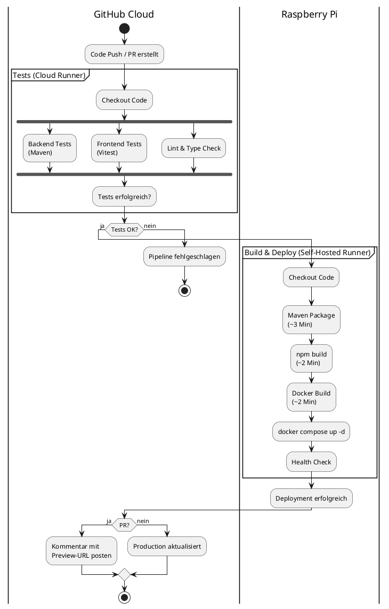

# 7. Verteilungssicht

Die Verteilungssicht beschreibt die technische Infrastruktur des PhysioAI-Systems und zeigt, wie die Software-Bausteine auf der Hardware-Infrastruktur verteilt sind.

## 7.1 Infrastruktur Ebene 1 - Gesamtsystem

Das PhysioAI-System läuft vollständig auf einem Raspberry Pi als lokales Gerät in der Physiotherapiepraxis.

```plantuml
@startuml

package "Physiotherapiepraxis" {
    node "🍓 Raspberry Pi 5" as rpi {
        artifact "PhysioAI Backend\n(Spring Boot)" as app
        database "PostgreSQL\nDatenbank" as db
        folder "Dateisystem\n(Uploads/Backups)" as fs
    }

    node "💻 Arbeitsplatz PC" as workstation {
        component "Flutter Desktop App" as flutter_desktop
    }

    node "📱 Tablet/Mobile" as mobile {
        component "Flutter Mobile App" as flutter_mobile
    }
}

cloud "☁️ Internet" {
    component "🤖 LLM API" as llm_api
    component "📅 iCloud Kalender" as icloud_calendar
}

flutter_desktop --> app : "HTTPS/REST API\n(Lokales Netzwerk)"
flutter_mobile --> app : "HTTPS/REST API\n(Lokales Netzwerk)"

app --> llm_api : "HTTPS/JSON\n(Gelegentlich)"
app <--> icloud_calendar : "CalDAV\n(Bidirektional)"

app --> db : "JDBC"
app --> fs : "File I/O"

@enduml
```



### Knoten und Ihre Verantwortlichkeiten

| Knoten | Typ | Beschreibung | Verantwortlichkeiten |
|--------|-----|--------------|---------------------|
| **Raspberry Pi 5** | Edge Device | Lokaler Server in der Praxis | - Hosting des Spring Boot Backends<br/>- Lokale Datenhaltung (PostgreSQL)<br/>- REST API-Bereitstellung für Flutter Apps |
| **Arbeitsplatz PCs** | Client Device | Desktop-Computer der Mitarbeiter | - Ausführung der Flutter Desktop App<br/>- Benutzerinteraktion<br/>- Lokale Client-seitige Logik |
| **Mobile Geräte** | Client Device | Tablets/Smartphones | - Ausführung der Flutter Mobile App<br/>- Benutzerinteraktion<br/>- Lokale Client-seitige Logik |
| **LLM API** | External Service | Cloud-basierte KI-Dienste | - Rezeptanalyse und OCR<br/>- Textextraktion und -verarbeitung |
| **iCloud Kalender** | External Service | Apple iCloud Kalender-Service | - Kalendersynchronisation |

---

## 7.2 Infrastruktur Ebene 2 - Container-Architektur

Das PhysioAI-System wird mit Docker Compose containerisiert. Jede Umgebung (Production, PR-Previews) besteht aus einem eigenen Stack isolierter Container.

```plantuml
@startuml

skinparam rectangle {
    BackgroundColor<<stack>> #E8F4EA
    BackgroundColor<<traefik>> #FFE4B5
}

package "Raspberry Pi 5 (8GB RAM)" {

    rectangle "Traefik\n(Reverse Proxy)" as traefik <<traefik>> {
        component "SSL Termination" as ssl
        component "Dynamic Routing" as routing
    }

    rectangle "Production Stack" as prod <<stack>> {
        component "physio-frontend-prod\n(nginx)" as frontend_prod
        component "physio-backend-prod\n(Spring Boot)" as backend_prod
        database "physio-db-prod\n(PostgreSQL)" as db_prod
    }

    rectangle "PR-Preview Stack (pr-42)" as preview <<stack>> {
        component "physio-frontend-pr-42\n(nginx)" as frontend_preview
        component "physio-backend-pr-42\n(Spring Boot)" as backend_preview
        database "physio-db-pr-42\n(PostgreSQL)" as db_preview
    }

    folder "LUKS-verschlüsseltes Volume\n/var/lib/physio-data" as encrypted {
        folder "postgres-prod" as vol_prod
        folder "postgres-pr-42" as vol_preview
    }

    rectangle "GitHub Actions Runner" as runner
}

traefik --> frontend_prod : "physioai.torben-keller.de"
traefik --> backend_prod : "api.physioai.torben-keller.de"
traefik --> frontend_preview : "pr-42.physioai.torben-keller.de"
traefik --> backend_preview : "pr-42.api.physioai.torben-keller.de"

frontend_prod --> backend_prod : "HTTP (intern)"
frontend_preview --> backend_preview : "HTTP (intern)"

backend_prod --> db_prod : "JDBC"
backend_preview --> db_preview : "JDBC"

db_prod --> vol_prod
db_preview --> vol_preview

runner ..> prod : "deploy"
runner ..> preview : "deploy"

@enduml
```



### Container-Konfiguration

| Container | Image | Ressourcen | Ports (intern) |
|-----------|-------|------------|----------------|
| **Traefik** | `traefik:v3.0` | ~100MB RAM | 80, 443 (extern) |
| **Frontend** | `physio-frontend:latest` | ~50MB RAM | 80 |
| **Backend** | `physio-backend:latest` | ~512MB RAM | 8080 |
| **PostgreSQL** | `postgres:16-alpine` | ~200MB RAM | 5432 |
| **GitHub Runner** | Native Installation | ~200MB RAM | - |

### Docker-Netzwerke

| Netzwerk | Zweck | Verbundene Container |
|----------|-------|---------------------|
| `traefik` | Externes Routing | Traefik, alle Frontends, alle Backends |
| `internal-prod` | Production-Isolation | Backend-Prod, DB-Prod |
| `internal-pr-{N}` | Preview-Isolation | Backend-PR-{N}, DB-PR-{N} |

---

## 7.3 CI/CD-Pipeline

Die Deployment-Pipeline nutzt GitHub Actions mit einer Kombination aus Cloud-Runnern (für Tests) und Self-Hosted-Runnern (für Builds und Deployments).



### Workflows

| Workflow | Trigger | Runner | Aktion |
|----------|---------|--------|--------|
| `test.yml` | Push, PR | `ubuntu-latest` (Cloud) | Tests, Lint, Type-Check |
| `deploy-production.yml` | Merge auf `main` | `self-hosted` (Pi) | Build + Deploy Production |
| `deploy-preview.yml` | PR opened/synchronize | `self-hosted` (Pi) | Build + Deploy Preview |
| `cleanup-preview.yml` | PR closed | `self-hosted` (Pi) | Preview-Stack entfernen |

### Build-Strategie

**Warum lokaler Build auf dem Pi?**
- Native ARM64-Kompilierung (kein QEMU-Emulations-Overhead)
- Kein Image-Transfer nötig (lokal gebaut = lokal verfügbar)
- Geschätzte Build-Dauer: ~5-8 Minuten (vs. ~20 Minuten mit QEMU)

---

## 7.4 Multi-Environment-Strategie

Das System unterstützt mehrere isolierte Umgebungen auf demselben Raspberry Pi:

```plantuml
@startuml

skinparam rectangle {
    BackgroundColor<<prod>> #C8E6C9
    BackgroundColor<<preview>> #BBDEFB
    BackgroundColor<<max>> #FFCDD2
}

rectangle "Production" as prod <<prod>> {
    note right: Immer aktiv\nphysioai.torben-keller.de
}

rectangle "PR-Preview #1" as preview1 <<preview>> {
    note right: Temporär\npr-42.physioai.torben-keller.de
}

rectangle "PR-Preview #2" as preview2 <<preview>> {
    note right: Temporär\npr-43.physioai.torben-keller.de
}

rectangle "Limit erreicht" as max <<max>> {
    note right: Max 2 Previews\n(RAM-Limit)
}

prod -[hidden]-> preview1
preview1 -[hidden]-> preview2
preview2 -[hidden]-> max

@enduml
```

### Umgebungs-Konfiguration

| Umgebung | Subdomain | Lebenszyklus | Datenbank |
|----------|-----------|--------------|-----------|
| **Production** | `physioai.torben-keller.de` | Permanent | Persistente Daten |
| **PR-Preview** | `pr-{N}.physioai.torben-keller.de` | Temporär (bis PR geschlossen) | Test-Daten, wird bei Cleanup gelöscht |

### Ressourcen-Limits

| Komponente | Pro Stack | Max (Prod + 2 Previews) |
|------------|-----------|-------------------------|
| Frontend | 50MB | 150MB |
| Backend | 512MB | 1.5GB |
| PostgreSQL | 200MB | 600MB |
| **Summe** | ~762MB | ~2.25GB |

Verfügbarer RAM nach System-Overhead (~1.5GB) und Traefik/Runner (~300MB): **~6GB**
→ Ausreichend für Production + 2 Previews mit Puffer

---

## 7.5 Netzwerk-Topologie

```plantuml
@startuml

skinparam cloud {
    BackgroundColor #E3F2FD
}

cloud "Internet" {
    actor "Benutzer" as user
    component "AWS Route 53\n(DNS)" as dns
    component "Let's Encrypt\n(Zertifikate)" as letsencrypt
}

package "Raspberry Pi 5" {

    rectangle "Port 443 (HTTPS)" as port443
    rectangle "Port 80 (HTTP → Redirect)" as port80

    component "Traefik" as traefik {
        component "SSL/TLS Termination" as ssl
        component "Router" as router
    }

    package "Docker Network: traefik" {
        component "Frontend-Prod" as fp
        component "Backend-Prod" as bp
        component "Frontend-PR-42" as fpr
        component "Backend-PR-42" as bpr
    }

    package "Docker Network: internal-prod" {
        database "DB-Prod" as dbp
    }

    package "Docker Network: internal-pr-42" {
        database "DB-PR-42" as dbpr
    }
}

user --> dns : "physioai.torben-keller.de"
dns --> port443 : "A-Record → Pi IP"
port80 --> traefik : "Redirect"
port443 --> traefik

traefik --> letsencrypt : "DNS Challenge\n(via Route 53)"

router --> fp : "Host: physioai..."
router --> bp : "Host: api.physioai..."
router --> fpr : "Host: pr-42.physioai..."
router --> bpr : "Host: pr-42.api.physioai..."

bp --> dbp : "internal-prod"
bpr --> dbpr : "internal-pr-42"

note bottom of dbp : Nicht von außen\nerreichbar

@enduml
```



### DNS-Konfiguration (AWS Route 53)

| Record | Typ | Wert |
|--------|-----|------|
| `physioai.torben-keller.de` | A | `<Raspberry-Pi-IP>` |
| `*.physioai.torben-keller.de` | A | `<Raspberry-Pi-IP>` |

### SSL/TLS

- **Zertifikat-Typ**: Wildcard (`*.physioai.torben-keller.de`)
- **Aussteller**: Let's Encrypt
- **Challenge**: DNS-01 via AWS Route 53
- **Verwaltung**: Automatisch durch Traefik

### Firewall-Regeln (Empfohlen)

| Port | Protokoll | Richtung | Zweck |
|------|-----------|----------|-------|
| 80 | TCP | Eingehend | HTTP → HTTPS Redirect |
| 443 | TCP | Eingehend | HTTPS Traffic |
| 22 | TCP | Eingehend | SSH (optional, nur lokales Netz) |
| * | * | Ausgehend | GitHub, Route 53, Let's Encrypt |
