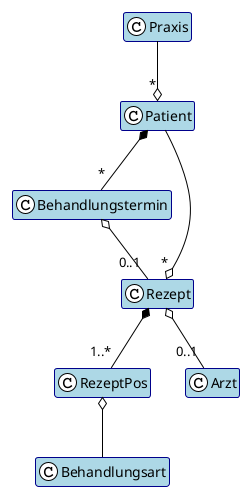

# 8. Querschnittliche Konzepte

> Hier beschreiben Sie übergreifende, prinzipielle Regelungen und Lösungsansätze, die in mehreren Teilen Ihres Systems relevant sind. Diese Konzepte betreffen meist mehrere Bausteine und können Themen wie Domänenmodelle, Architekturmuster und Implementierungsregeln umfassen.

## 8.1 Fachliches Datenmodell (Domain Model)

Das fachliche Datenmodell bildet die Kerngeschäftskonzepte einer Physiotherapiepraxis ab. Die Hauptentitäten repräsentieren die zentralen Geschäftsobjekte und deren Beziehungen untereinander.

### Übersicht der Geschäftsentitäten

### Geschäftsregeln

- Eine **Praxis** verwaltet ihre **Patienten** (Multi-Tenancy-Konzept)
- Ein **Patient** gehört zu genau einer **Praxis** und kann mehrere **Behandlungstermine** haben
- **Behandlungstermine** sind fest mit einem **Patienten** verbunden (Komposition)
- Ein **Patient** kann mehrere **Rezepte** von verschiedenen **Ärzten** erhalten
- Ein **Rezept** enthält eine oder mehrere **RezeptPos** (Komposition - ohne Rezept existieren keine Positionen)
- **Behandlungstermine** können optional einem **Rezept** zugeordnet werden
- **RezeptPos** referenziert eine **Behandlungsart** für Preiskalkulationen

### Beziehungsverantwortlichkeiten

Die Aggregations- und Kompositionsbeziehungen im Diagramm zeigen die **Verantwortlichkeit für das Beziehungsmanagement** an:

**Komposition (`*--`)**: Starke Eigentumsbeziehung
- `Patient *-- Behandlungstermin`: Patient verwaltet seine Termine direkt
- `Rezept *-- RezeptPos`: Rezept enthält und verwaltet seine Positionen

**Aggregation (`--o`)**: Beziehungsverwaltung ohne direkte Speicherung
- `Praxis --o Patient`: Praxis verwaltet die Beziehung, aber Patient speichert nur `praxisId`
- `Behandlungstermin o-- Rezept`: Behandlungstermin kennt optional sein Rezept (`rezeptId`)

**Architektonische Konsequenzen:**
- Praxis hat keine Liste aller Patienten → `PatientRepository.findByPraxisId()`
- Patient kennt seine Behandlungstermine → direkte Navigation möglich
- Rezept kennt seine Positionen → direkte Aggregation in Entity
- Behandlungstermin referenziert Rezept → optionale Verknüpfung via ID

## 8.2 Transaktionsbehandlung

### DDD-Transaktionsgrenzen

Das System folgt den **Domain-Driven Design Prinzipien** für Transaktionsgrenzen:

**Grundprinzip:** Aggregates sind **Konsistenzgrenzen** und definieren Transaktionsgrenzen.

### Transaktionsregeln

**Eine Transaktion = Ein Aggregate**
- Jede Geschäftstransaktion umfasst **exakt ein** Aggregate Root
- **Es gibt keine Transaktionen über mehrere Aggregates**
- Cross-Aggregate Konsistenz wird über **Eventual Consistency** sichergestellt
- **Application Services** orchestrieren sequenzielle Operationen auf einzelnen Aggregates

