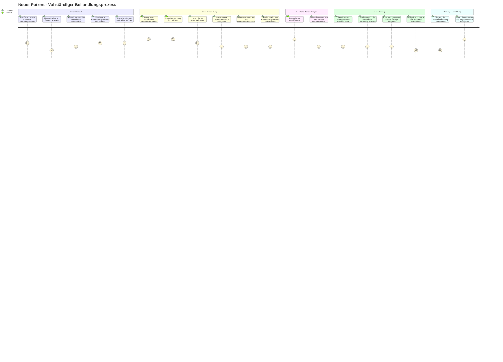

# User Journey: Neuer Patient - Von der ersten Behandlung bis zur bezahlten Rechnung

Diese User Journey beschreibt den kompletten Prozess vom ersten Patientenkontakt bis zur bezahlten Rechnung eines Privatrezepts in Physio AI aus der Perspektive von Carsten Weber.

## Mermaid User Journey Diagramm

